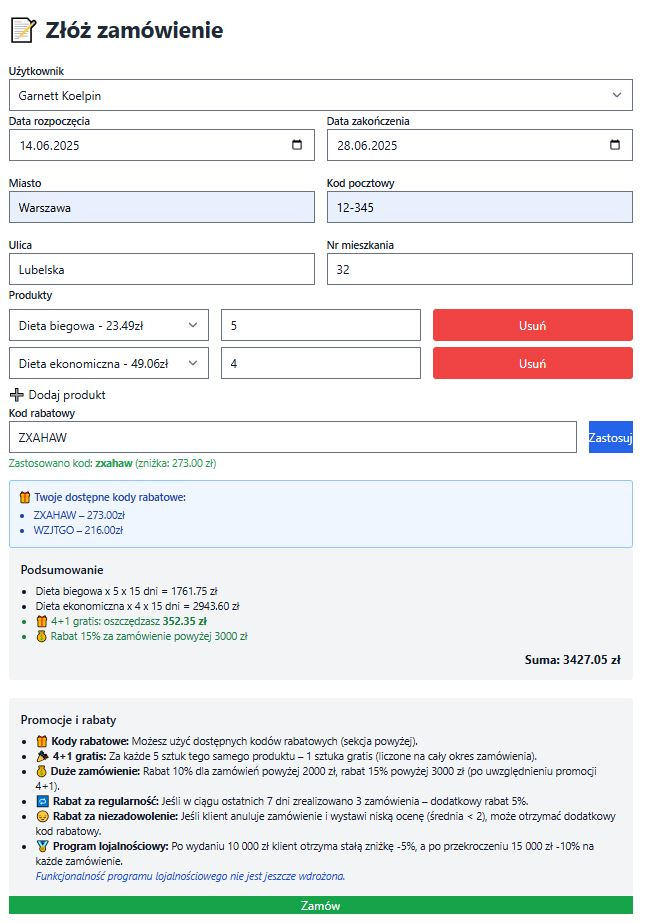
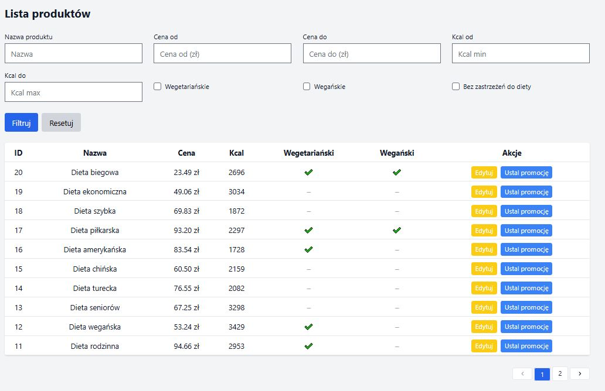

# Laravel Diet Catering 

[Repozytorium projektu](https://github.com/dazw00110/laravel-diet-catering)

[Tablica projektowa](https://github.com/users/dazw00110/projects/3)

---

### Temat projektu

System do zamawiania cateringu dietetycznego (dieta pudełkowa) z obsługą promocji, opinii, kalendarza cateringów oraz panelami dla klienta, pracownika i administratora.

---

### Zespół F4

| Profil | Rola |
| ------ | ------ |
| [dazw00110](https://github.com/dazw00110/Automated-Discretization-Framework) | lider zespołu |
| [Shakalito](https://github.com/Shakalito) | członek zespołu |
| [Kriisowy](https://github.com/Kriisowy) | członek zespołu |

---

## Opis projektu

Aplikacja umożliwia użytkownikom zamawianie diet pudełkowych, zarządzanie zamówieniami, korzystanie z rabatów i opinii oraz obsługę zamówień przez pracowników i administratorów. System wspiera różne role użytkowników, automatyzuje procesy biznesowe i zapewnia przejrzysty interfejs.

## Dostępne funkcjonalności

### Klient

- Rejestracja konta z możliwością podania preferencji dietetycznych (np. weganin, wegetarianin). Po rejestracji użytkownik może zalogować się do systemu.
- Logowanie z obsługą dwuskładnikowego uwierzytelniania (TOTP). Po poprawnym zalogowaniu użytkownik uzyskuje dostęp do panelu klienta.
- Reset hasła – możliwość wygenerowania jednorazowego tokena resetującego hasło (token generowany w konsoli, bez wysyłki mailowej).
- Przeglądanie dostępnych ofert cateringu – lista wszystkich aktywnych produktów cateringowych, dostępna także dla niezalogowanych użytkowników.
- Filtrowanie ofert po typie diety (np. tylko wegańskie), zakresie cen, ocenach/opiniach. Użytkownik może wybrać interesujące go kryteria i zawęzić wyniki.
- Sortowanie ofert po kaloryczności, cenie, ocenach. Użytkownik może zmienić kolejność wyświetlania ofert według wybranego parametru.
- Paginacja ofert – oferty dzielone są na strony, co umożliwia wygodne przeglądanie dużej liczby produktów.
- Dodawanie produktów do koszyka – użytkownik może dodać wybrane produkty do koszyka, określając ilość każdego produktu. Operacja wykonywana jest dynamicznie.
- Formularz składania zamówienia – użytkownik wybiera produkty i ich ilości, datę rozpoczęcia i zakończenia cateringu, wpisuje adres dostawy, może użyć kodu rabatowego oraz widzi podsumowanie zastosowanych promocji (np. 4+1 gratis, -10%, rabat lojalnościowy).
- Zarządzanie historią zamówień – użytkownik ma dostęp do listy swoich zamówień, może przeglądać szczegóły każdego zamówienia (produkty, daty, status, cena, rabaty).
- Interaktywny kalendarz zamówień – wizualizacja trwających i przyszłych zamówień na osi czasu.
- Wystawianie opinii po zakończonym cateringu – użytkownik może ocenić catering (ocena 1–5 gwiazdek oraz komentarz). Opinie są anonimowe i widoczne przy produktach.
- System lojalnościowy - nagradza użytkowników rabatami w zależności od ich aktywności w aplikacji.
- Powiadomienia o kończącym się cateringu – system wyświetla powiadomienie o zbliżającym się końcu zamówienia.
- Możliwość anulowania zamówienia – użytkownik może anulować zamówienie
- Po anulowaniu użytkownik może ocenić produkty, które zamówił, jeśli nie jest z nich zadowolony może otrzymać kod rabatowy

### Pracownik

- Przegląd wszystkich zamówień – pracownik ma dostęp do listy wszystkich zamówień (aktywnych, zakończonych, anulowanych).
- Filtrowanie zamówień po statusie, kliencie, dacie, wartości zamówienia. Pracownik może szybko znaleźć interesujące go zamówienia.
- Edycja zamówienia – możliwość zmiany szczegółów zamówienia (np. daty, produkty, adres, status).
- Anulowanie zamówienia – pracownik może anulować zamówienie klienta, podając powód anulowania.
- Oznaczenie zamówienia jako zakończone – po zrealizowaniu zamówienia pracownik może zmienić jego status na zakończone.
- Tworzenie zamówień dla klienta – pracownik może wprowadzić zamówienie w imieniu klienta (np. zamówienia telefoniczne).
- Przeglądanie statystyk sprzedaży – pracownik ma dostęp do wykresów i danych dotyczących liczby zamówień (dziennie, tygodniowo, miesięcznie), najlepiej sprzedających się cateringów, top klientów wg wydatków, średniej ceny zamówienia. Możliwy jest eksport danych lub filtrowanie po miesiącu.
- Zarządzanie ofertą i promocjami – pracownik może dodawać i edytować produkty cateringowe, ustalać promocje last minute (np. -50% przez 2h), zarządzać rabatami przypisanymi do użytkowników.

### Administrator
- Dostęp do panelu administracyjnego z czytelnym menu – użytkownicy, zamówienia, produkty, statystyki, profil.
- Zarządzanie użytkownikami – administrator może przeglądać listę wszystkich kont, filtrować po imieniu, e-mailu, roli oraz preferencjach dietetycznych (weganin, wegetarianin).
- Dodawanie nowych użytkowników – możliwość ręcznego tworzenia kont klienta, pracownika lub innego administratora.
- Edycja i usuwanie użytkowników – zmiana danych osobowych, ról i preferencji użytkowników oraz możliwość trwałego usunięcia konta.
- Przeglądanie wszystkich zamówień – widok wszystkich zamówień w systemie, z podziałem na statusy (w koszyku, w trakcie, zakończone, anulowane).
- Filtrowanie zamówień – wyszukiwanie po kliencie, przedziale cen, dacie początkowej i końcowej, statusie oraz lokalizacji.
- Edycja zamówień – możliwość zmiany dat, statusu, produktów, adresu dostawy i kodu rabatowego.
- Anulowanie zamówień – administrator może ręcznie anulować każde zamówienie, z możliwością przypisania powodu i powiązanego rabatu.
- Zakończenie zamówienia – oznaczenie zamówienia jako zakończone po jego realizacji.
- Dodawanie nowych zamówień – możliwość utworzenia zamówienia w imieniu klienta.
- Zarządzanie ofertami cateringowymi – pełny CRUD produktów: dodawanie, edycja, usuwanie, filtrowanie po nazwie, cenie, kaloriach i tagach dietetycznych.
- Obsługa kodów rabatowych – administrator może tworzyć rabaty procentowe i kwotowe, ustawiać datę ważności oraz przypisywać je do konkretnych użytkowników.
- Promocje last minute – możliwość tworzenia ograniczonych czasowo promocji na wybrane produkty.
- Zarządzanie statystykami – dostęp do wykresów i zestawień sprzedaży: liczba zamówień, wartość sprzedaży, średnia cena, najlepsi klienci, najczęściej wybierane produkty.
- Porównywanie danych – statystyki porównywane miesiąc do miesiąca (np. czerwiec vs maj).
- Podgląd konta administratora – edycja profilu i możliwość włączenia TOTP (dwuskładnikowego uwierzytelniania).
- Pełna kontrola nad rolami i dostępami – administrator może nadawać lub odbierać role oraz promować użytkowników do roli pracownika lub administratora.

---

### Narzędzia i technologie
- **PHP 8.3** 
- **Laravel 12.x** 
- **PostgreSQL 15**
- **Composer** 
- **Node.js + Vite** 
- **Blade** 
- **TailwindCSS** 
- **Faker** 
- **Docker** 
- **Laravel Breeze**
- **Spomky-Labs/otphp**

---

### Uruchomienie aplikacji

Aby uruchomić aplikację lokalnie, wykonaj poniższe kroki:

1. **Wymagania:**
   - PHP 8.2 lub nowszy
   - Composer
   - Node.js + npm
   - PostgreSQL (lub inna baza zgodna z konfiguracją)

2. **Przygotowanie bazy danych:**
   - Utwórz bazę danych PostgreSQL (np. `laravel_diet_catering`).
   - Skonfiguruj użytkownika i hasło zgodnie z plikiem `.env`.

3. **Konfiguracja środowiska:**
   - Skopiuj plik `.env.example` do `.env`.
   - Ustaw w `.env` parametry bazy danych (`DB_DATABASE`, `DB_USERNAME`, `DB_PASSWORD`, `DB_HOST`, `DB_PORT`).

4. **Automatyczne uruchomienie (Windows):**
   - Uruchom plik `start.bat` w katalogu projektu.
   - Skrypt wykona:
     - utworzenie pliku `.env` (jeśli nie istnieje),
     - instalację zależności PHP i JS,
     - migracje i seedowanie bazy,
     - wygenerowanie klucza aplikacji,
     - uruchomienie serwera backendu i frontendu (Vite).

5. **Ręczne uruchomienie (alternatywnie):**
   ```
   composer install
   npm install
   php artisan storage:link
   php artisan key:generate
   php artisan migrate --seed
   npm run dev
   php artisan serve
   ```

7. **Dostęp do aplikacji:**
   - Po uruchomieniu aplikacja będzie dostępna pod adresem:  
     http://127.0.0.1:8000

### Skrypt bat:
```
@echo off
title Laravel Diet Catering - Setup

echo ===============================================
echo Laravel Setup Script
echo ===============================================

REM Tworzenie pliku .env jeśli nie istnieje
IF NOT EXIST .env (
    echo Tworzenie pliku .env z .env.example...
    copy .env.example .env
)

REM Tworzenie wymaganych folderów
echo Tworzenie folderow tymczasowych...
mkdir bootstrap\cache >nul 2>nul
mkdir storage\framework\cache >nul 2>nul
mkdir storage\framework\sessions >nul 2>nul
mkdir storage\framework\views >nul 2>nul
mkdir storage\logs >nul 2>nul

REM Instalacja zależności PHP
echo Instalowanie zaleznosci PHP...
IF EXIST composer.phar (
    call php composer.phar install
) ELSE (
    call composer install
)

IF NOT EXIST vendor\autoload.php (
    echo Blad: composer install nie powiodl sie.
    pause
    exit /b
)

REM Linkowanie storage (ważne!)
echo Tworzenie linku storage...
call php artisan storage:link

REM Generowanie klucza
echo Generowanie klucza aplikacji...
call php artisan key:generate

REM Migracje + seedy
echo Migracje i seedy...
call php artisan migrate:fresh --seed

REM Instalacja npm
IF EXIST package.json (
    echo Instalacja paczek NPM...
    call npm install
) ELSE (
    echo Brak package.json — pomijam npm install.
)

REM Uruchomienie serwerów
echo Uruchamianie Vite i backendu Laravel...
start cmd /k "npm run dev"
start cmd /k "php artisan serve"

echo ===============================================
echo Wszystko gotowe! Odwiedz: http://127.0.0.1:8000
echo ===============================================
pause

 ```

### **Przykładowi użytkownicy:**
   - administrator: admin@demo.com admin123
   - pracownik(staff): staff@demo.com staff123
   - klient: client@demo.com client123

## Baza danych


## Widoki Aplikacji
---

### Użytkownik niezalogowany

#### Strona główna aplikacji
Po wejściu na stronę widzimy następujący landing page


#### Strona rejestracji
Formularz rejestracji z wyborem preferencji dietetycznych.


#### Strona logowania
Formularz logowania z obsługą TOTP.


#### Resetowanie hasła
Formularz do resetowanie hasła.


#### Przegląd ofert cateringowych dla niezalogwanego użytkownika
Niezalogowany użytkownik może zobaczyć oferty


---

### Panel klienta

#### Panel główny
Panel główny Clienta nie różni się od panelu użytkownika niezalogowanego


#### Przegląd ofert cateringowych
Lista dostępnych cateringów z filtrowaniem, sortowaniem i paginacją.


#### Przegląd opinii o produkcie
Po kliknięciu w zobacz opinie o produkcie możemy zobaczyć jak inni ocenili ten produkt.


#### Kontakt
Możliwość kontaktu z obsługą – formularz kontaktowy lub dane kontaktowe.


Po złożeniu zapytania wyświetla się komunikat


#### Moje zamówienia
Lista wszystkich zamówień klienta z możliwością podglądu szczegółów, statusu oraz anulowania.


#### Dodawanie opinii
Użytkownik może dodać opinię dla produktu, którego jeszcze nie ocenił
 

#### Przyznawanie rabatow
Jeśli użytkownikowi nie spodoba się catering, otrzyma rabat 


#### Moje konto
Panel do sterowania kontem zalogowanego użytkownika


Mamy możliwość włączyczenia uwierzytelniania dwuskładnikowego


Możemy także edytować konto lub całkowicie je usunąć


#### Koszyk
Podsumowanie wybranych produktów, możliwość edycji ilości, usuwania oraz przejścia do zamówienia.

Pusty koszyk wygląda tak:


Dodajemy produkty do koszyka


Sprawdzamy teraz stan koszyka


Jak widać produkty zostały dodane do koszyka, a zniżki zostały zastosowane takie jak 4+1 lub duże zamówienie zostały zastosowane.
Klient skorzystał z kuponu.

Po wypełnienniu wszystkich danych klikamy na Kup, a serwer trasuje nas do zamówień. Możemy tutaj zobaczyć, że zamówienie zostało dodane


Możemy także przerwać zamówienie klikająć na przycisk przerwji zamówienie


Mamy teraz możliwość ponownego zamówienia. Klikamy na zamów ponownie, a system automatycznie trasuje nas do koszyka identycznym jak przy poprzednim zamówieniu.


Istnieje możliwość opróżnienia koszyka. W tym celu naciskamy na opróżnij koszyk:


---

### Panel pracownika

#### Panel główny pracownika
Po zalogowaniu pracownik widzi przejrzysty panel z dostępem do najważniejszych sekcji:
- **Użytkownicy** – przeglądaj i edytuj konta użytkowników.
- **Zamówienia** – zarządzaj realizowanymi zamówieniami klientów.
- **Produkty** – aktualizuj dostępne oferty cateringowe.
- **Statystyki** – analizuj dane sprzedaży i wyniki cateringu.
- **Mój profil** – zarządzaj swoim kontem i ustawieniami.


#### Użytkownicy
Pracownik może przeglądać listę klientów, edytować ich dane dodawać nowych klientów


Po kliknięciu Dodaj Klienta


Jak widać klient został dodany do zbioru klientów


Możemy także modyfikować klienta. Będziemy modyfikować nazwisko Jana Kowalskiego


Modyfikacja klientów działa

#### Zamówienia
Widok wszystkich zamówień klientów z możliwością filtrowania, edycji, anulowania i oznaczania jako zakończone.


Dodawanie zamówień 


Jak widać udało się dodać zamówienie


Szczegóły zamówienia


Spróbujemy zedytować zamówienie: 
 

Jak widać edycja się powiodła


Spróbujemy zmienić status na anulowano
 

Usuwanie zamówienia Klienta Client User


#### Produkty
Pracownik może przeglądać i edytować oferty cateringowe, wprowadzać promocje last minute.


Produkty możemy edytować
Spróbujemy zmienić zdjęcie oraz cenę diety biegowej
Przed modyfikcja cena wynosiła 23,49 zł za dzień, zmienimy tą wartość na 30zł
 

Jak widać modyfikacja powiodła się 


Promocja last minute
Spróbujemy wprowadzić promocję last minute dla diety biegowej z 30zł na 15zł, a czas trwania ustalimy na godzine
 

Jak widać promocja działa 

#### Statystyki
Panel z wykresami i danymi dotyczącymi sprzedaży, top klientów oraz najlepiej sprzedających się cateringów.
Raport możemy modyfikować wybierająć określony miesiąc oraz status


Zaimplementowano możliwość wydrukowania raportu po kliknięciu na Drukuj Raport:


#### Mój profil
Możliwość edycji własnych danych, zmiany hasła oraz ustawień konta pracownika. Ten panel działa identycznie jak dla panelu Klienta, dlatego nie będzie go omawiać.


---

### Panel administratora

#### Panel główny administratora
Po zalogowaniu administrator widzi przejrzysty panel z dostępem do wszystkich kluczowych sekcji systemu:
- **Użytkownicy** – zarządzaj kontami użytkowników i pracowników.
- **Zamówienia** – przeglądaj i edytuj wszystkie zamówienia.
- **Produkty** – aktualizuj oferty cateringowe.
- **Statystyki** – podgląd danych i analiz sprzedażowych.
- **Mój profil** – zarządzaj swoimi danymi i bezpieczeństwem.


#### Użytkownicy
Administrator ma pełną kontrolę nad użytkownikami – może dodawać, edytować, usuwać konta, zmieniać role oraz preferencje dietetyczne. Prawie tak samo jak w panelu użytkownika. Dodatkową funkcjonalnością w porównaniu do panelu pracownika jest usuwanie użytkownikóww


Aby usunąć użytkownika naciskamy na Usuń, a następnie sprawdzmay czy użytkownik istnieje w bazie danych


Jak widać użytkownika Jan Kowal nie ma już w bazie dnaych

Reszta funkcjonalności pozostaje bez zmian w porównaniu do wcześniej omawianego panelu pracownika.


#### Produkty
Panel produktów nie ma opcji dodania oferty last minute, poza tym wszystkie funkcjonalności pozostają bez zmian.

Panele Zamówienia, Statystyki oraz Mój Profil niczym nie różnią się w porównaniu do panelu pracownika, dlatego nie będziemy ich ponownie omawiać.

---

## Podsumowanie

Projekt **Laravel Diet Catering** to kompleksowy system do obsługi cateringu dietetycznego, który łączy wygodę użytkownika końcowego z zaawansowanymi narzędziami administracyjnymi i pracowniczymi. Dzięki rozbudowanemu panelowi klienta, pracownika oraz administratora, aplikacja umożliwia sprawne zarządzanie ofertą, zamówieniami, promocjami i użytkownikami. System został zaprojektowany z myślą o bezpieczeństwie (TOTP, role), automatyzacji procesów oraz przejrzystości interfejsu. 

Wszystkie kluczowe funkcjonalności zostały zilustrowane zrzutami ekranu, co pozwala szybko zapoznać się z możliwościami aplikacji. Projekt jest gotowy do dalszego rozwoju i wdrożenia w środowisku produkcyjnym.


